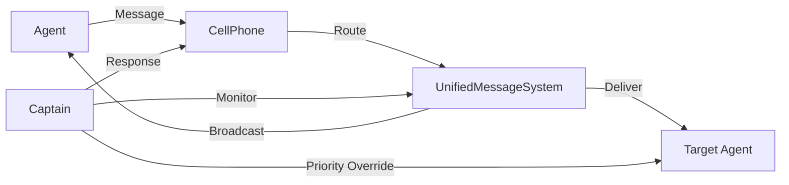
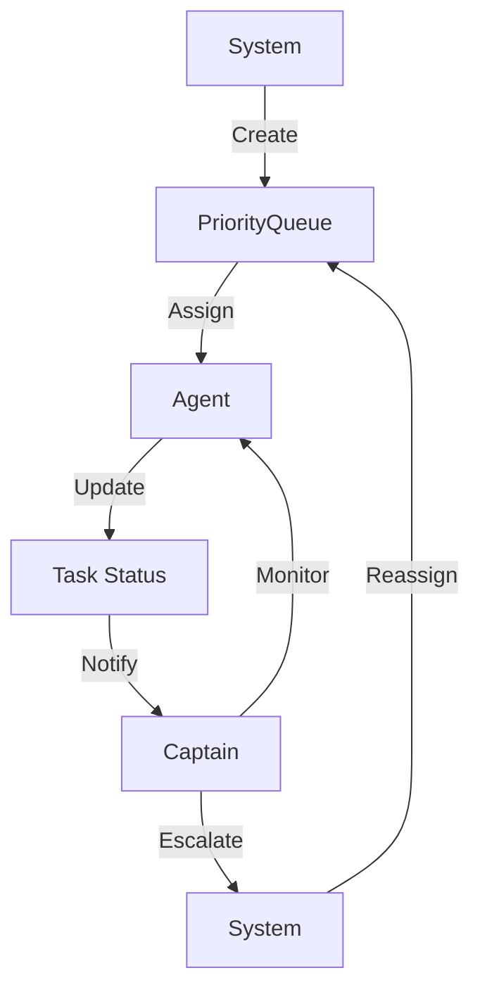
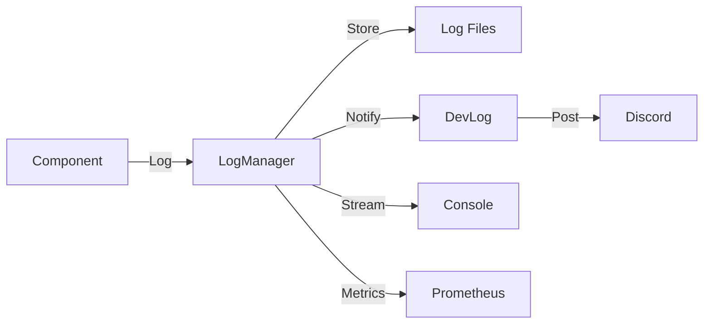

# Dream.OS

[](https://github.com/victor-general/Dream.OS/actions)
[](https://codecov.io/gh/victor-general/Dream.OS)

## Overview

Dream.OS is a swarm-driven platform for coordinating autonomous agents. It aims to provide a reliable operating environment where multiple agents can collaborate on complex tasks across domains such as content generation, data analysis and social media automation. The system currently offers:

For a quick reference of the repository layout, see [docs/directory_overview.md](docs/directory_overview.md).

- Agent control and coordination
- Message processing and routing
- Social media integration
- UI automation and interaction
- Stealth browser automation for low-detection web tasks
- Dreamscribe narrative memory system

## Repository Structure

The project is organized into feature-oriented folders. Below is a brief summary
of the most important directories:

- `dreamos/` – Core functionality and utilities
  - `core/` – Core system components
  - `utils/` – Shared utilities
  - `config/` – Configuration files
  - `logs/` – System logs
  - `tasks/` – Task definitions
  - `mailbox/` – Agent communication
- `agent_tools/` – Utilities for managing agents and scanning projects.
- `discord_bot/` – Discord integration and bot commands.
- `crime_report_generator/` – Stand‑alone module for generating crime reports.
- `tools/` – Assorted helper scripts and automation utilities.
- `runtime/` – Temporary runtime files such as queues and logs.
- `data/` – Generated data artifacts and reports.
- `tests/` – Unit and integration tests.
- `docs/` – Additional documentation including this overview.

## Product Offerings

The Dream.OS platform can be packaged in several ways to fit different business needs. See [docs/product_offerings.md](docs/product_offerings.md) for details on SaaS, social-media automation, on-premise deployments, and a custom agent SDK.

## Project Goals

Dream.OS seeks to be a comprehensive operating system for AI agents. Our primary goals are:

- Create a unified framework for orchestrating many autonomous agents.
- Provide standard messaging, logging and monitoring utilities.
- Offer modular integrations such as Discord interfaces and a ChatGPT bridge.
- Enable reproducible, automated workflows for research and production environments.

## Development Roadmap

The project is progressing through several planned phases. We are currently in **Phase 2 – Feature Expansion**.

1. **Phase 1 – Core Architecture (complete)**
   - Implemented agent lifecycle management, unified messaging and basic logging.
   - Introduced initial CLI and Discord tools.
2. **Phase 2 – Feature Expansion (current)**
   - Expanding content loops.
   - Enhancing Discord and ChatGPT bridges.
   - Expanding tests and documentation.
3. **Phase 3 – Scalability & Hardening (in progress)**
   - Docker-based container deployment.
   - Metrics server with Grafana dashboard.
   - Hardened log file permissions.
4. **Phase 4 – Production Release (planned)**
   - Stable release with plugin ecosystem.
   - Formal support channels and deployment guides.

## Installation

## Quick Start

1. Clone the repository:
```bash
git clone https://github.com/yourusername/dreamos.git
cd dreamos
```

2. Create required directories:
```bash
mkdir -p dreamos/mailbox/agent0
touch dreamos/mailbox/agent0/inbox.json
```

3. Install dependencies:
```bash
pip install -r requirements.txt
```

4. Run the system:
```bash
python -m dreamos
```

## Usage Example

```python
from dreamos.core.mailbox.message_handler import MessageHandler

# Initialize message handler
message_handler = MessageHandler(base_dir="dreamos/mailbox")
```

## Core Components

### 1. System Orchestrator (`dreamos.core.orchestrator.SystemOrchestrator`)
The central control unit that coordinates all system components:
- Manages agent lifecycle and communication
- Handles task distribution and monitoring
- Maintains system-wide logging
- Coordinates with external services (Discord, etc.)
- Implements the Captain role for agent supervision

### 2. Agent Management
- **AgentManager** (`dreamos.core.agent_control.agent_manager`)
  - Handles agent lifecycle (creation, monitoring, restart)
  - Implements auto-resume after idle timeout
- **UnifiedMessageSystem** (`dreamos.core.messaging.unified_message_system`)
  - Centralized messaging hub for all agents
  - Handles routing, history, and priority delivery
- **CellPhone** (`dreamos.core.messaging.cell_phone`)
  - Manages direct agent-to-agent messaging
  - Implements retry logic for failed deliveries
- **CaptainPhone** (`dreamos.core.messaging.captain_phone`)
  - Specialized communication channel for Captain-agent interactions
  - High-priority message routing

### 3. Task Management (`dreamos.core.tasks.task_manager`)
- **TaskManager**: Handles task creation, assignment, and tracking
  - Supports task priorities and dependencies
  - Maintains task history and status
  - Integrates with agent status monitoring

Example task creation:
```python
from dreamos.core.tasks.task_manager import TaskManager

tm = TaskManager()
task_id = tm.create_task(
    title="Fix agent loop bug",
    description="Agents drop out after first cycle. Implement auto-resume.",
    priority=10,
    assigned_to="agent_4"
)
```

### 4. Logging System (`dreamos.core.logging.log_manager`)
- **LogManager**: Centralized logging with multiple platforms:
  - System logs (`logs/system.log`)
  - Agent logs (`logs/agents.log`)
  - Task logs (`logs/tasks.log`)
  - DevLog entries (`logs/devlog.log`)
  - Message history (`logs/messages.log`)
  - Captain monitoring logs (`logs/captain.log`)
- Supports log rotation and archival
- Provides structured logging with tags and levels

Example logging configuration (`config/system_config.yaml`):
```yaml
logging:
  level: INFO
  rotate:
    when: midnight
    backup_count: 7
  platforms:
    system: system.log
    agents: agents.log
    tasks: tasks.log
    devlog: devlog.log
    messages: messages.log
    captain: captain.log
```

## Messaging System

The Dream.OS messaging system is built on a robust mailbox-based architecture that enables secure and reliable agent-to-agent communication.

### Key Components

- **Mailbox Handler**: Core messaging system that manages message routing, delivery, and cleanup
- **Cell Phone**: High-level interface for agents to send and receive messages
- **Message Queue**: Local queue for message buffering and status tracking

### Directory Structure

```
dreamos/
  └── mailbox/
      ├── agent0/
      │   ├── inbox.json
      │   └── devlog.md
      ├── agent1/
      │   ├── inbox.json
      │   └── devlog.md
      └── ...
```

### Features

- **Secure Routing**: Messages are routed through dedicated inbox files
- **Message Processing**: Built-in support for message status tracking and cleanup
- **Agent Groups**: Support for agent grouping and message filtering
- **Sequence Numbers**: Automatic sequence number management for message ordering
- **Cleanup**: Automatic cleanup of old processed messages

### Usage

```python
from dreamos.core.mailbox.message_handler import MessageHandler
from dreamos.core.messaging.cell_phone import CellPhone

# Initialize the message handler
message_handler = MessageHandler(base_dir="dreamos/mailbox")

# Create a cell phone for an agent
cell_phone = CellPhone(config={
    "agent_id": "agent0",
    "message_handler": message_handler,
    "log_level": "INFO"
})

# Send a message
success = cell_phone.send_message(
    to_agent="agent1",
    content="Hello from agent0!",
    metadata={"priority": "high"}
)

# Get messages
messages = cell_phone.get_messages()

# Clear messages
cell_phone.clear_messages()
```

### Message Format

```json
{
    "from": "agent0",
    "to": "agent1",
    "content": "Hello!",
    "timestamp": "2024-03-21T12:00:00Z",
    "metadata": {
        "priority": "high",
        "type": "notification"
    }
}
```

### Best Practices

1. **Message Cleanup**
   - Use the built-in cleanup mechanism to prevent disk space issues
   - Configure cleanup thresholds based on your needs

2. **Error Handling**
   - Always check return values from send_message()
   - Handle message processing errors gracefully

3. **Performance**
   - Use message batching for bulk operations
   - Implement proper error handling and retries

4. **Security**
   - Validate agent IDs before sending messages
   - Use metadata for message categorization
   - Implement proper access controls

## Usage

```python
from dreamos.core.agent_control import AgentControl
from dreamos.core.message_processor import MessageProcessor

# Initialize components
agent_control = AgentControl()
message_processor = MessageProcessor()

# Process a message
message = "Hello, world!"
response = message_processor.process_message(message)
```

## Development

### Running Tests

```bash
# Run all tests
pytest

# Run with coverage
pytest --cov=dreamos

# Generate HTML coverage report
pytest --cov=dreamos --cov-report=html
```

### Code Style

We use:
- Black for code formatting
- isort for import sorting
- flake8 for linting

```bash
# Format code
black .

# Sort imports
isort .

# Lint code
flake8
```

## Contributing

1. Fork the repository
2. Create a feature branch
3. Make your changes
4. Run tests and linting
5. Submit a pull request

## License

MIT License - see LICENSE file for details

# Dream.OS System Architecture

## Overview
Dream.OS is a sophisticated multi-agent operating system designed to coordinate and manage autonomous agents through a centralized orchestration system. The system provides robust communication, task management, logging, and monitoring capabilities.

## Core Components

### 1. System Orchestrator
The central control unit that coordinates all system components:
- Manages agent lifecycle and communication
- Handles task distribution and monitoring
- Maintains system-wide logging
- Coordinates with external services (Discord, etc.)
- Implements the Captain role for agent supervision

### 2. Agent Management
- **AgentManager**: Handles agent lifecycle (creation, monitoring, restart)
 - **UnifiedMessageSystem**: Centralized hub for agent communication
 - **CellPhone**: Manages direct agent-to-agent messaging
 - **CaptainPhone**: Specialized communication channel for Captain-agent interactions

### 3. Task Management
- **TaskManager**: Handles task creation, assignment, and tracking
- Supports task priorities and dependencies
- Maintains task history and status
- Integrates with agent status monitoring

### 4. Logging System
- **LogManager**: Centralized logging with multiple platforms:
  - System logs
  - Agent logs
  - Task logs
  - DevLog entries
  - Message history
  - Captain monitoring logs
- Supports log rotation and archival
- Provides structured logging with tags and levels

### 5. Communication Infrastructure
- **Message**: Structured message format for agent communication
- **Message History**: Persistent storage of all communications
- **DevLog**: Integration with Discord for external logging
- **CellPhone/CaptainPhone**: Specialized communication channels

## System Flow

### 1. Agent Communication


### 2. Task Management


### 3. Logging Flow


## Key Features

### 1. Captain Monitoring (`dreamos.core.orchestrator.CaptainMonitor`)
- Continuous monitoring of agent communications
  - Polls each agent's devlog folder
  - Automatically escalates idle agents after 5 minutes
  - Maintains agent health metrics
- Automatic response to help requests
  - Keyword-based detection
  - Context-aware responses
  - Task status integration
- Task status tracking
  - Real-time progress monitoring
  - Dependency resolution
  - Priority management
- Agent performance monitoring
  - Response time tracking
  - Resource usage metrics
  - Error rate monitoring

### 2. Message Management
- **CellPhone** (`dreamos.core.messaging.cell_phone`)
  - Direct message routing
  - Retry logic (3 attempts)
  - Message queuing
  - Delivery confirmation
- **CaptainPhone** (`dreamos.core.messaging.captain_phone`)
  - High-priority override channel
  - Emergency broadcast capability
  - System-wide announcements
- Message History
  - Persistent storage
  - Query capabilities
  - Retention policies
  - Export functionality

### 3. Task Management
- Priority-based task assignment
  - 5 priority levels
  - Dynamic reprioritization
  - Deadline management
- Dependency tracking
  - Task chains
  - Parallel execution
  - Blocked task detection
- Status monitoring
  - Real-time updates
  - Progress tracking
  - Resource allocation
- Task history and reporting
  - Performance metrics
  - Completion rates
  - Time tracking

### 4. Logging and Monitoring
- Multi-platform logging
  - Structured JSON format
  - Log rotation
  - Compression
- Log rotation and archival
  - Daily rotation
  - 7-day retention
  - Compression after 3 days
- Structured logging with tags
  - Component identification
  - Error categorization
  - Performance tracking
- External logging via Discord
  - Real-time alerts
  - Status updates
  - Error notifications

## System Configuration

### Required Components
1. Runtime Directory Structure:
```
dreamos/
├── config/
│   └── system_config.yaml
├── data/
│   └── message_history.json
├── logs/
│   ├── system.log
│   ├── agents.log
│   ├── tasks.log
│   ├── devlog.log
│   ├── messages.log
│   └── captain.log
└── runtime/
```

### Configuration Parameters
- Discord integration (token, channel ID)
- Logging levels and rotation policies
- Task management settings
- Agent monitoring parameters

## Usage Guidelines

### 1. Agent Communication
- Use CellPhone for direct agent-to-agent communication
- Use CaptainPhone for Captain-agent interactions
- Follow message format guidelines
- Monitor message history for context

### 2. Task Management
- Create tasks with clear priorities
- Monitor task dependencies
- Update task status regularly
- Review task history for patterns

### 3. Logging
- Use appropriate log levels
- Include relevant tags
- Monitor log rotation
- Review logs for system health

### 4. Captain Role
- Monitor agent communications
- Respond to help requests
- Track task progress
- Maintain system stability

## Error Handling

### 1. Communication Errors
- Message delivery failures
  - Automatic retry (3 attempts)
  - Failure logging
  - Dead letter queue
- Connection issues
  - Automatic reconnection
  - Connection pooling
  - Timeout handling
- Timeout handling
  - Configurable timeouts
  - Graceful degradation
  - Fallback mechanisms
- Retry mechanisms
  - Exponential backoff
  - Circuit breaker
  - Bulkhead pattern

### 2. Task Management
- Failed task assignments
  - Automatic retry
  - Alternative agent selection
  - Task splitting
- Dependency conflicts
  - Automatic resolution
  - Manual override
  - Conflict logging
- Status update failures
  - Local caching
  - Batch updates
  - Recovery procedures
- Task recovery procedures
  - State restoration
  - Checkpoint management
  - Rollback capability

### 3. Logging Issues
- File permission problems
  - Automatic permission repair
  - Fallback logging
  - Alert generation
- Disk space management
  - Automatic cleanup
  - Space monitoring
  - Alert thresholds
- Log rotation failures
  - Backup creation
  - Manual rotation
  - Error reporting
- Recovery procedures
  - Log file repair
  - Data recovery
  - System notification

## Best Practices

### 1. Agent Development
- Follow communication protocols
  - Use CellPhone for standard messages
  - Use CaptainPhone for urgent matters
  - Include proper message tags
- Implement proper error handling
  - Catch and log exceptions
  - Implement retry logic
  - Provide fallback behavior
- Maintain task status updates
  - Regular progress reports
  - Clear status messages
  - Dependency notifications
- Use appropriate logging levels
  - DEBUG for development
  - INFO for normal operation
  - WARNING for recoverable issues
  - ERROR for critical problems

### 2. System Administration
- Monitor system resources
  - CPU usage
  - Memory consumption
  - Disk space
  - Network bandwidth
- Review logs regularly
  - Daily log rotation
  - Weekly log analysis
  - Monthly performance review
- Maintain configuration
  - Version control configs
  - Document changes
  - Test configurations
- Update components as needed
  - Security patches
  - Feature updates
  - Bug fixes

### 3. Task Management
- Clear task descriptions
  - Purpose
  - Requirements
  - Dependencies
  - Success criteria
- Proper priority assignment
  - Use all 5 levels
  - Consider dependencies
  - Review regularly
- Regular status updates
  - Progress tracking
  - Blocking issues
  - Completion estimates
- Dependency management
  - Clear dependencies
  - Parallel tasks
  - Critical path

### 4. Logging
- Appropriate log levels
  - DEBUG: Detailed debugging
  - INFO: General information
  - WARNING: Potential issues
  - ERROR: Serious problems
- Meaningful tags
  - Component name
  - Operation type
  - Status code
- Regular log review
  - Daily checks
  - Weekly analysis
  - Monthly reports
- Proper error handling
  - Exception details
  - Stack traces
  - Context information

## Future Enhancements

### 1. Planned Features
- **ENH-001**: Enhanced agent monitoring
  - Real-time metrics ([docs/metrics_dashboard.md](docs/metrics_dashboard.md))
  - Predictive analytics
  - Health scoring
- **ENH-002**: Advanced task scheduling
  - Cron-style scheduling
  - Resource-based allocation
  - Dynamic prioritization
- **ENH-003**: Improved logging analytics
  - Log pattern detection
  - Anomaly detection
  - Trend analysis
- **ENH-004**: Extended communication protocols
  - WebSocket support
  - gRPC integration
  - Message encryption

### 2. Integration Points
- **INT-001**: Additional external services
  - Slack integration
  - Email notifications
  - SMS alerts
- **INT-002**: Enhanced Discord integration
  - Rich embeds
  - Interactive buttons
  - Thread support
- **INT-003**: Extended monitoring capabilities
  - Grafana dashboards
  - Prometheus metrics
  - AlertManager integration
- **INT-004**: Advanced reporting features
  - Custom reports
  - Export options
  - Visualization tools

## Contributing
Please follow these guidelines when contributing to the system:

1. Follow existing code structure
   - Use established patterns
   - Maintain consistency
   - Document changes

2. Maintain logging standards
   - Use proper levels
   - Include tags
   - Add context

3. Update documentation
   - Update README
   - Add docstrings
   - Update examples

4. Add appropriate tests
   - Unit tests
   - Integration tests
   - Performance tests

5. Follow error handling patterns
   - Use custom exceptions
   - Implement retries
   - Add logging

## Support

### Getting Help
1. Review logs for issues
   ```bash
   tail -f logs/system.log
   tail -f logs/agents.log
   tail -f logs/captain.log
   ```

2. Check agent status
   ```bash
   python run_menu.py
   # Select "List Agents" to see status
   ```

3. Monitor task progress
   ```bash
   python run_menu.py
   # Select "View Task Board" for details
   ```

### Contact
- **GitHub Issues**: [Report bugs or request features](https://github.com/victor-general/Dream.OS/issues)
- **Discord**: [Join our support server](https://discord.gg/dreamos)
- **Email**: support@dreamos.ai

## License
Copyright (c) 2025 Victor (General Victor)

MIT License. See [LICENSE](LICENSE) for details.

Permission is hereby granted, free of charge, to any person obtaining a copy
of this software and associated documentation files (the "Software"), to deal
in the Software without restriction, including without limitation the rights
to use, copy, modify, merge, publish, distribute, sublicense, and/or sell
copies of the Software, and to permit persons to whom the Software is
furnished to do so, subject to the following conditions:

The above copyright notice and this permission notice shall be included in all
copies or substantial portions of the Software.

THE SOFTWARE IS PROVIDED "AS IS", WITHOUT WARRANTY OF ANY KIND, EXPRESS OR
IMPLIED, INCLUDING BUT NOT LIMITED TO THE WARRANTIES OF MERCHANTABILITY,
FITNESS FOR A PARTICULAR PURPOSE AND NONINFRINGEMENT. IN NO EVENT SHALL THE
AUTHORS OR COPYRIGHT HOLDERS BE LIABLE FOR ANY CLAIM, DAMAGES OR OTHER
LIABILITY, WHETHER IN AN ACTION OF CONTRACT, TORT OR OTHERWISE, ARISING FROM,
OUT OF OR IN CONNECTION WITH THE SOFTWARE OR THE USE OR OTHER DEALINGS IN THE
SOFTWARE.

# Dream.OS Agent Control System

A sophisticated agent control system with Discord bot integration for remote management and monitoring of autonomous agents.

## Project Structure

```
Dream.OS/
├── dreamos/                    # Core system modules
│   ├── core/                  # Core functionality
│   │   ├── agent_control/     # Agent control system
│   │   ├── messaging/         # Message handling
│   │   ├── ui/               # User interface
│   │   └── utils/            # Core utilities
│   ├── agents/               # Agent implementations
│   └── dashboard/            # System dashboard
├── discord_bot/               # Discord bot integration
│   ├── bot.py                # Main bot implementation
│   ├── commands.py           # Bot command handlers
│   └── config.json          # Bot configuration
├── runtime/                   # Runtime files
│   ├── agent_comms/          # Agent communications
│   │   ├── governance/       # System governance
│   │   └── onboarding/       # Agent onboarding
│   └── config/               # Configuration files
├── docs/                      # Documentation
│   ├── onboarding/           # Agent onboarding guides
│   ├── development/          # Development guides
│   └── api/                  # API documentation
├── tests/                     # Test suite
│   ├── core/                 # Core system tests
│   ├── agents/               # Agent tests
│   └── integration/          # Integration tests
├── agent_resume_main.py      # Main agent control interface
├── agent_cellphone.py        # Cell phone communication system
├── message_processor.py      # Message handling system
├── run_menu.py              # CLI menu interface
├── tools/life_os_dashboard.py   # Personal dashboard
└── setup.py                 # Package setup
```

## Core Components

### 1. Agent Control System
- Remote agent management
- State verification and repair
- Message broadcasting
- System status monitoring

### 2. Messaging System
- Priority-based message queue
- Multiple message types
- Rate limiting
- Message history tracking

### 3. Content Loop Framework
- Autonomous content generation
- Task-based content seeding
- Masterpiece development track
- Multi-domain output streams:
  - Conversation Highlights
  - DevLogs
  - Self-Improvement Reports
  - Entertainment Content

## Documentation

### 1. Onboarding
- [Agent Core Guide](docs/onboarding/01_agent_core.md)
- [Autonomous Operations](docs/onboarding/02_autonomous_operations.md)
- [System Integration](docs/onboarding/03_system_integration.md)
- [Advanced Topics](docs/onboarding/04_advanced_topics.md)
- [Architecture Overview](docs/architecture_overview.md)
- [Content Loop Framework](docs/onboarding/05_content_loop.md)
- [Training Overview](docs/onboarding/06_training_overview.md)

### 2. Development
- [Code Style Guide](docs/code_style_guide.md)
- [Testing Guide](docs/testing_guide.md)
- [Testing Strategy](docs/testing_strategy.md)
- [Project Setup](docs/project_setup_guide.md)
- [User Guide](docs/user_guide.md)
- [Contribution Guide](docs/contribution_guide.md)

### 3. API Reference
- [Core API](docs/api/core.md)
- [Agent API](docs/api/agents.md)
- [Messaging API](docs/api/messaging.md)
- [StealthBrowser API](docs/api/stealth_browser.md)
- [Dreamscribe API](docs/api/dreamscribe.md)

## Features

- **Agent Control System**
  - Remote agent management
  - State verification and repair
  - Message broadcasting
  - System status monitoring

- **Discord Bot Integration**
  - Real-time agent control
  - Status monitoring
  - Command-based interface
  - Secure token management

- **Message System**
  - Priority-based message queue
  - Multiple message types
  - Rate limiting
  - Message history tracking


## Setup

### Prerequisites

- Python 3.8+
- Discord Bot Token
- Required Python packages:
  ```bash
  pip install discord.py pyautogui
  ```

### Installation

1. Clone the repository:
   ```bash
   git clone <repository-url>
   cd Dream.OS
   ```

2. Set up environment variables:
   ```bash
   cp discord_bot/env.example discord_bot/.env
   # Edit the `.env` file with your tokens and credentials
   ```

3. Install the package:
   ```bash
   pip install -e .
   ```

### Discord Bot Setup

1. Create a Discord application at https://discord.com/developers/applications
2. Create a bot and enable required intents:
   - Message Content Intent
   - Server Members Intent
   - Presence Intent
3. Copy the bot token to your `.env` file
4. Generate an invite link with required permissions:
   - Read Messages/View Channels
   - Send Messages
   - Embed Links
   - Read Message History


## Usage

### Starting the Discord Bot

```bash
python -m discord_bot.bot
```

### Available Commands

- `!list` - List all available agents
- `!resume <agent_id>` - Resume an agent's operations
- `!verify <agent_id>` - Verify an agent's state
- `!message <agent_id> <message>` - Send a custom message
- `!status` - Get system status and recent messages
- `!broadcast <message>` - Send message to all agents
- `!askgpt <text>` - Query ChatGPT and return the reply


### Running the CLI Interface

```bash
python run_menu.py
```

### Backup and Restore

Use `tools/backup_restore.py` to archive agent mailboxes, devlogs and
task queues.

```bash
# Create a backup archive
python tools/backup_restore.py backup backups/dreamos_backup.tar.gz

# Restore from an archive
python tools/backup_restore.py restore backups/dreamos_backup.tar.gz
```

## Development

### Running Tests

```bash
# Cell phone system tests
python test_cell_phone.py

```

### Adding New Commands

1. Add command to `discord_bot/commands.py`
2. Update cooldowns in `discord_bot/config.json`
3. Test the command locally

## Security

- Bot tokens stored in environment variables
- Command cooldowns prevent spam
- Channel restrictions available
- Role-based permissions
- API credentials encrypted
- Risk management controls
- See [docs/security_best_practices.md](docs/security_best_practices.md) for container hardening guidelines.

## Contributing

1. Fork the repository
2. Create a feature branch
3. Commit your changes
4. Push to the branch
5. Create a Pull Request

## License

[Your License Here]

## Support

For support, please [contact details or issue tracker information] 