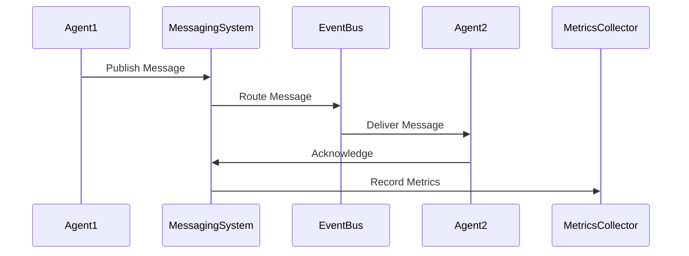
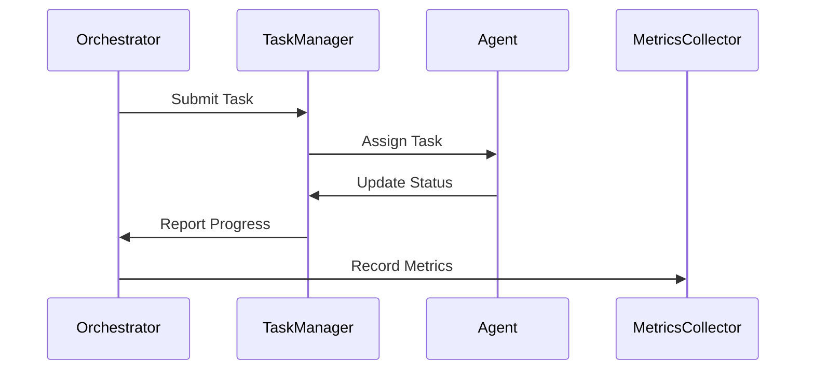
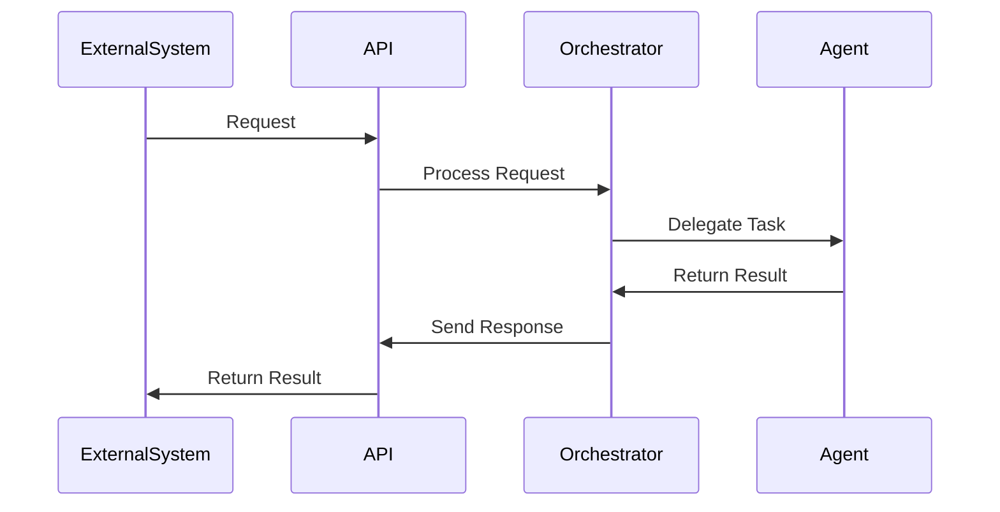

# Dream.OS Core Architecture

## Directory Structure

```
dreamos/
├── core/                    # Core system components
│   ├── agent/              # Agent-related functionality
│   │   ├── control/        # Agent control and management
│   │   ├── lifecycle/      # Agent lifecycle management
│   │   └── state/          # Agent state management
│   ├── automation/         # Automation components
│   │   ├── browser/        # Browser automation
│   │   ├── chat/          # Chat automation
│   │   └── ui/            # UI automation
│   ├── bridge/            # Bridge components
│   │   ├── chatgpt/       # ChatGPT integration
│   │   ├── cursor/        # Cursor integration
│   │   └── handlers/      # Bridge handlers
│   ├── messaging/         # Messaging system
│   │   ├── queue/         # Message queues
│   │   ├── handlers/      # Message handlers
│   │   └── processors/    # Message processors
│   ├── monitoring/        # System monitoring
│   │   ├── health/        # Health checks
│   │   ├── metrics/       # Metrics collection
│   │   └── logging/       # Logging system
│   └── utils/             # Shared utilities
├── config/                # Configuration files
│   ├── agent/            # Agent configurations
│   ├── bridge/           # Bridge configurations
│   └── system/           # System configurations
├── docs/                 # Documentation
│   ├── architecture/     # Architecture docs
│   ├── api/             # API documentation
│   └── guides/          # User guides
└── tests/               # Test suite
    ├── unit/            # Unit tests
    ├── integration/     # Integration tests
    └── e2e/            # End-to-end tests
```

## Core Components

### 1. Agent System
- **Control**: Agent lifecycle management, state tracking, and coordination
- **Lifecycle**: Agent initialization, shutdown, and recovery
- **State**: Agent state persistence and management

### 2. Automation System
- **Browser**: Browser automation and control
- **Chat**: Chat interaction and management
- **UI**: UI automation and interaction

### 3. Bridge System
- **ChatGPT**: ChatGPT integration and management
- **Cursor**: Cursor integration and control
- **Handlers**: Bridge request/response handling

### 4. Messaging System
- **Queue**: Message queue management
- **Handlers**: Message processing and routing
- **Processors**: Message content processing

### 5. Monitoring System
- **Health**: System health monitoring
- **Metrics**: Performance metrics collection
- **Logging**: Centralized logging system

## Configuration Management

### 1. Agent Configuration
- Agent roles and permissions
- Agent behavior settings
- Agent communication settings

### 2. Bridge Configuration
- Bridge connection settings
- API endpoints and credentials
- Rate limiting and quotas

### 3. System Configuration
- System-wide settings
- Resource limits
- Performance tuning

## Documentation Structure

### 1. Architecture Documentation
- System design and components
- Data flow and interactions
- Security considerations

### 2. API Documentation
- API endpoints and methods
- Request/response formats
- Authentication and authorization

### 3. User Guides
- Installation and setup
- Configuration and customization
- Troubleshooting and maintenance

## Testing Strategy

### 1. Unit Testing
- Component-level testing
- Mock dependencies
- Fast execution

### 2. Integration Testing
- Component interaction testing
- End-to-end flow testing
- Performance testing

### 3. End-to-End Testing
- Full system testing
- User scenario testing
- Load and stress testing

## Overview

Dream.OS is built on a modular, event-driven architecture that enables flexible agent interactions, robust task management, and efficient resource utilization. This document describes the core architectural components and their interactions.

## Core Components

### 1. System Orchestrator
The central coordination system that manages agent lifecycle, task distribution, and system resources.

```python
class SystemOrchestrator:
    def __init__(self):
        self.agent_registry = AgentRegistry()
        self.task_manager = TaskManager()
        self.resource_manager = ResourceManager()
        self.metrics_collector = MetricsCollector()
        self.health_monitor = HealthMonitor()

    async def start(self):
        """Initialize and start all core components"""
        await self.agent_registry.initialize()
        await self.task_manager.initialize()
        await self.resource_manager.initialize()
        await self.metrics_collector.initialize()
        await self.health_monitor.initialize()

    async def shutdown(self):
        """Gracefully shutdown all components"""
        await self.health_monitor.shutdown()
        await self.metrics_collector.shutdown()
        await self.resource_manager.shutdown()
        await self.task_manager.shutdown()
        await self.agent_registry.shutdown()
```

### 2. Messaging Layer
Handles all inter-agent communication and event distribution.

```python
class MessagingSystem:
    def __init__(self):
        self.event_bus = EventBus()
        self.message_queue = MessageQueue()
        self.pubsub = PubSubSystem()
        self.rate_limiter = RateLimiter()

    async def publish(self, topic: str, message: Dict):
        """Publish message to topic"""
        await self.rate_limiter.check_limit(topic)
        await self.pubsub.publish(topic, message)
        await self.metrics_collector.record_message(topic)

    async def subscribe(self, topic: str, callback: Callable):
        """Subscribe to topic"""
        await self.pubsub.subscribe(topic, callback)
        await self.metrics_collector.record_subscription(topic)
```

### 3. Task Manager
Manages task lifecycle, scheduling, and execution.

```python
class TaskManager:
    def __init__(self):
        self.task_queue = TaskQueue()
        self.scheduler = TaskScheduler()
        self.executor = TaskExecutor()
        self.retry_manager = RetryManager()

    async def submit_task(self, task: Task):
        """Submit new task for execution"""
        await self.task_queue.enqueue(task)
        await self.scheduler.schedule(task)
        await self.metrics_collector.record_task_submission(task)

    async def get_task_status(self, task_id: str) -> TaskStatus:
        """Get current task status"""
        return await self.task_queue.get_status(task_id)
```

### 4. Logging System
Provides structured logging and log aggregation.

```python
class LoggingSystem:
    def __init__(self):
        self.log_manager = LogManager()
        self.log_aggregator = LogAggregator()
        self.log_rotator = LogRotator()
        self.metrics_collector = MetricsCollector()

    async def log(self, level: str, message: str, **kwargs):
        """Log message with metadata"""
        await self.log_manager.log(level, message, **kwargs)
        await self.metrics_collector.record_log(level)
        await self.log_aggregator.aggregate(level, message, **kwargs)
```

### 5. Extension System
Manages system extensions and plugins.

```python
class ExtensionSystem:
    def __init__(self):
        self.extension_manager = ExtensionManager()
        self.plugin_loader = PluginLoader()
        self.dependency_resolver = DependencyResolver()
        self.metrics_collector = MetricsCollector()

    async def load_extension(self, extension: Extension):
        """Load and initialize extension"""
        await self.dependency_resolver.resolve(extension)
        await self.plugin_loader.load(extension)
        await self.extension_manager.register(extension)
        await self.metrics_collector.record_extension_load(extension)
```

## Communication Flow

### 1. Agent-to-Agent Communication


### 2. Command and Control


### 3. External Integration


## Storage Architecture

### 1. Runtime Storage
- In-memory cache for fast access
- Persistent storage for durability
- Distributed storage for scalability
- Backup and recovery mechanisms

### 2. Memory Management
- Efficient memory allocation
- Garbage collection
- Memory pooling
- Resource limits

## Security Architecture

### 1. Authentication
- Token-based authentication
- Role-based access control
- Multi-factor authentication
- Session management

### 2. Authorization
- Permission management
- Resource access control
- API security
- Data protection

### 3. Data Protection
- Encryption at rest
- Encryption in transit
- Secure key management
- Data sanitization

## Monitoring Architecture

### 1. Metrics Collection
```python
class SystemMetrics:
    def __init__(self):
        self.collectors = {
            'performance': PerformanceCollector(),
            'resources': ResourceCollector(),
            'health': HealthCollector()
        }
        self.aggregator = MetricsAggregator()
        self.storage = MetricsStorage()

    async def collect(self):
        """Collect all system metrics"""
        for collector in self.collectors.values():
            metrics = await collector.collect()
            await self.aggregator.aggregate(metrics)
            await self.storage.store(metrics)
```

### 2. Health Monitoring
```python
class SystemHealth:
    def __init__(self):
        self.checks = {
            'system': SystemHealthCheck(),
            'agents': AgentHealthCheck(),
            'services': ServiceHealthCheck()
        }
        self.reporter = HealthReporter()
        self.storage = HealthStorage()

    async def check(self):
        """Run all health checks"""
        for check in self.checks.values():
            status = await check.run()
            await self.reporter.report(status)
            await self.storage.store(status)
```

### 3. Performance Monitoring
```python
class PerformanceMonitor:
    def __init__(self):
        self.monitors = {
            'cpu': CPUMonitor(),
            'memory': MemoryMonitor(),
            'network': NetworkMonitor()
        }
        self.analyzer = PerformanceAnalyzer()
        self.storage = PerformanceStorage()

    async def monitor(self):
        """Monitor system performance"""
        for monitor in self.monitors.values():
            metrics = await monitor.collect()
            await self.analyzer.analyze(metrics)
            await self.storage.store(metrics)
```

## Deployment Architecture

### 1. Container Deployment
```yaml
version: '3.8'
services:
  orchestrator:
    build: .
    ports:
      - "8000:8000"
    environment:
      - NODE_ENV=production
    volumes:
      - ./data:/app/data
    deploy:
      replicas: 3
      resources:
        limits:
          cpus: '1'
          memory: 1G
```

### 2. Service Discovery
```python
class ServiceDiscovery:
    def __init__(self):
        self.registry = ServiceRegistry()
        self.health_checker = HealthChecker()
        self.load_balancer = LoadBalancer()

    async def register(self, service: Service):
        """Register new service"""
        await self.registry.register(service)
        await self.health_checker.start_checking(service)
        await self.load_balancer.add_service(service)
```

### 3. Load Balancing
```python
class LoadBalancer:
    def __init__(self):
        self.strategy = RoundRobinStrategy()
        self.health_monitor = HealthMonitor()
        self.metrics_collector = MetricsCollector()

    async def route(self, request: Request) -> Service:
        """Route request to appropriate service"""
        service = await self.strategy.select()
        await self.health_monitor.check(service)
        await self.metrics_collector.record_route(service)
        return service
```

## System Patterns

### 1. Observer Pattern
```python
class SystemObserver:
    def __init__(self):
        self.observers = {}
        self.event_bus = EventBus()

    async def register(self, event: str, observer: Callable):
        """Register observer for event"""
        if event not in self.observers:
            self.observers[event] = []
        self.observers[event].append(observer)
        await self.event_bus.subscribe(event, observer)

    async def notify(self, event: str, data: Any):
        """Notify observers of event"""
        await self.event_bus.publish(event, data)
        for observer in self.observers.get(event, []):
            await observer(data)
```

### 2. Command Pattern
```python
class SystemCommand:
    def __init__(self):
        self.command_history = []
        self.undo_stack = []

    async def execute(self, command: Command):
        """Execute command"""
        await command.execute()
        self.command_history.append(command)
        self.undo_stack.clear()

    async def undo(self):
        """Undo last command"""
        if self.command_history:
            command = self.command_history.pop()
            await command.undo()
            self.undo_stack.append(command)
```

### 3. Strategy Pattern
```python
class SystemStrategy:
    def __init__(self):
        self.strategies = {}
        self.current_strategy = None

    async def register(self, name: str, strategy: Strategy):
        """Register strategy"""
        self.strategies[name] = strategy

    async def execute(self, name: str, *args, **kwargs):
        """Execute strategy"""
        strategy = self.strategies.get(name)
        if strategy:
            self.current_strategy = strategy
            return await strategy.execute(*args, **kwargs)
```

## Development Guidelines

### 1. Architecture Principles
- Modularity
- Scalability
- Maintainability
- Security
- Performance
- Reliability

### 2. Code Organization
- Clear module boundaries
- Consistent naming
- Documentation
- Testing
- Error handling
- Logging

### 3. Best Practices
- Follow SOLID principles
- Write unit tests
- Document code
- Handle errors
- Monitor performance
- Secure data

## Resources

### Documentation
- [Architecture Overview](architecture.md)
- [Development Guide](development.md)
- [API Reference](api.md)
- [Security Guide](security.md)

### Tools
- Development environment
- Testing framework
- Monitoring tools
- Deployment tools
- Security tools
- Performance tools 