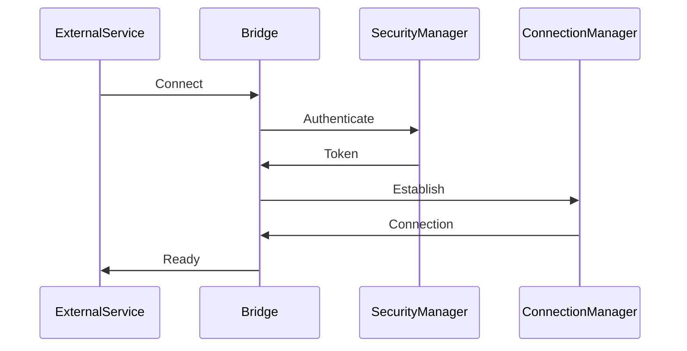
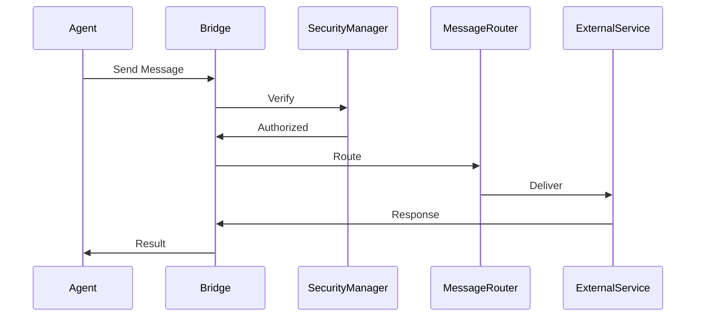
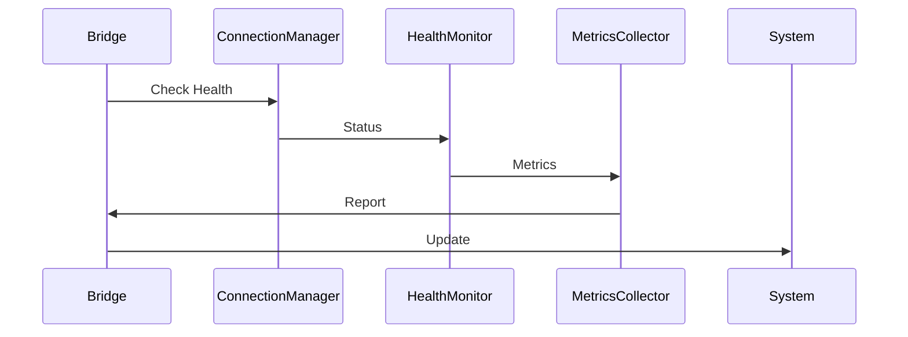

# Dream.OS Bridge Architecture

## Overview

The Dream.OS Bridge is a critical component that enables seamless communication between the Dream.OS core system and external services. It provides a unified interface for agent interactions, data exchange, and service integration.

## Core Components

### 1. Bridge Manager
The central coordination system for bridge operations.

```python
class BridgeManager:
    def __init__(self):
        self.connection_manager = ConnectionManager()
        self.message_router = MessageRouter()
        self.security_manager = SecurityManager()
        self.metrics_collector = MetricsCollector()

    async def initialize(self):
        """Initialize bridge components"""
        await self.connection_manager.initialize()
        await self.message_router.initialize()
        await self.security_manager.initialize()
        await self.metrics_collector.initialize()

    async def shutdown(self):
        """Gracefully shutdown bridge"""
        await self.metrics_collector.shutdown()
        await self.security_manager.shutdown()
        await self.message_router.shutdown()
        await self.connection_manager.shutdown()
```

### 2. Connection Management
Handles connection lifecycle and state management.

```python
class ConnectionManager:
    def __init__(self):
        self.connections = {}
        self.connection_pool = ConnectionPool()
        self.health_monitor = HealthMonitor()

    async def establish(self, service: str) -> Connection:
        """Establish connection to service"""
        connection = await self.connection_pool.acquire(service)
        await self.health_monitor.start_monitoring(connection)
        self.connections[service] = connection
        return connection

    async def terminate(self, service: str):
        """Terminate connection to service"""
        if connection := self.connections.get(service):
            await self.health_monitor.stop_monitoring(connection)
            await self.connection_pool.release(connection)
            del self.connections[service]
```

### 3. Message Routing
Manages message flow between systems.

```python
class MessageRouter:
    def __init__(self):
        self.routes = {}
        self.message_queue = MessageQueue()
        self.rate_limiter = RateLimiter()

    async def route(self, message: Message):
        """Route message to appropriate destination"""
        await self.rate_limiter.check_limit(message.destination)
        await self.message_queue.enqueue(message)
        await self.metrics_collector.record_message(message)

    async def register_route(self, pattern: str, handler: Callable):
        """Register new message route"""
        self.routes[pattern] = handler
        await self.metrics_collector.record_route(pattern)
```

### 4. Security Layer
Provides authentication and authorization.

```python
class SecurityManager:
    def __init__(self):
        self.auth_provider = AuthProvider()
        self.token_manager = TokenManager()
        self.access_control = AccessControl()

    async def authenticate(self, credentials: Dict) -> Token:
        """Authenticate and generate token"""
        user = await self.auth_provider.verify(credentials)
        token = await self.token_manager.generate(user)
        await self.metrics_collector.record_auth(user)
        return token

    async def authorize(self, token: Token, resource: str) -> bool:
        """Check resource access authorization"""
        return await self.access_control.check_access(token, resource)
```

## Communication Flow

### 1. External Service Integration


### 2. Message Exchange


### 3. Health Monitoring


## Security Architecture

### 1. Authentication
- Token-based authentication
- OAuth2 integration
- API key management
- Session handling

### 2. Authorization
- Role-based access control
- Resource permissions
- API security
- Rate limiting

### 3. Data Protection
- TLS encryption
- Message signing
- Data validation
- Input sanitization

## Monitoring and Metrics

### 1. Connection Metrics
```python
class ConnectionMetrics:
    def __init__(self):
        self.metrics = {
            'active_connections': 0,
            'connection_errors': 0,
            'latency': [],
            'throughput': 0
        }
        self.collector = MetricsCollector()

    async def record_connection(self, connection: Connection):
        """Record connection metrics"""
        self.metrics['active_connections'] += 1
        await self.collector.record('connection_established')

    async def record_error(self, error: Exception):
        """Record connection error"""
        self.metrics['connection_errors'] += 1
        await self.collector.record('connection_error')
```

### 2. Message Metrics
```python
class MessageMetrics:
    def __init__(self):
        self.metrics = {
            'messages_sent': 0,
            'messages_received': 0,
            'message_errors': 0,
            'message_latency': []
        }
        self.collector = MetricsCollector()

    async def record_message(self, message: Message):
        """Record message metrics"""
        self.metrics['messages_sent'] += 1
        await self.collector.record('message_sent')

    async def record_received(self, message: Message):
        """Record received message"""
        self.metrics['messages_received'] += 1
        await self.collector.record('message_received')
```

## Error Handling

### 1. Connection Errors
```python
class ConnectionErrorHandler:
    def __init__(self):
        self.retry_manager = RetryManager()
        self.error_logger = ErrorLogger()
        self.metrics_collector = MetricsCollector()

    async def handle(self, error: ConnectionError):
        """Handle connection error"""
        await self.error_logger.log(error)
        await self.metrics_collector.record('connection_error')
        return await self.retry_manager.retry(error)
```

### 2. Message Errors
```python
class MessageErrorHandler:
    def __init__(self):
        self.error_logger = ErrorLogger()
        self.metrics_collector = MetricsCollector()
        self.recovery_manager = RecoveryManager()

    async def handle(self, error: MessageError):
        """Handle message error"""
        await self.error_logger.log(error)
        await self.metrics_collector.record('message_error')
        return await self.recovery_manager.recover(error)
```

## Best Practices

### 1. Connection Management
- Connection pooling
- Automatic reconnection
- Health monitoring
- Resource cleanup

### 2. Message Handling
- Message validation
- Error recovery
- Rate limiting
- Queue management

### 3. Security
- Regular key rotation
- Access auditing
- Security monitoring
- Vulnerability scanning

## Configuration

### 1. Bridge Configuration
```yaml
bridge:
  host: localhost
  port: 8000
  max_connections: 100
  connection_timeout: 30
  retry_attempts: 3
  retry_delay: 5
```

### 2. Security Configuration
```yaml
security:
  auth_type: token
  token_expiry: 3600
  rate_limit: 1000
  allowed_origins:
    - https://api.example.com
    - https://service.example.com
```

### 3. Monitoring Configuration
```yaml
monitoring:
  metrics_enabled: true
  health_check_interval: 30
  log_level: INFO
  alert_threshold: 0.9
```

## Development Guidelines

### 1. Adding New Services
1. Define service interface
2. Implement connection handler
3. Add security rules
4. Configure monitoring
5. Update documentation

### 2. Error Handling
1. Define error types
2. Implement handlers
3. Add recovery logic
4. Update metrics
5. Document procedures

### 3. Testing
1. Unit tests
2. Integration tests
3. Load tests
4. Security tests
5. Performance tests

## Resources

### Documentation
- [API Reference](api.md)
- [Security Guide](security.md)
- [Monitoring Guide](monitoring.md)
- [Development Guide](development.md)

### Tools
- Bridge CLI
- Monitoring dashboard
- Testing framework
- Security scanner
- Performance analyzer 