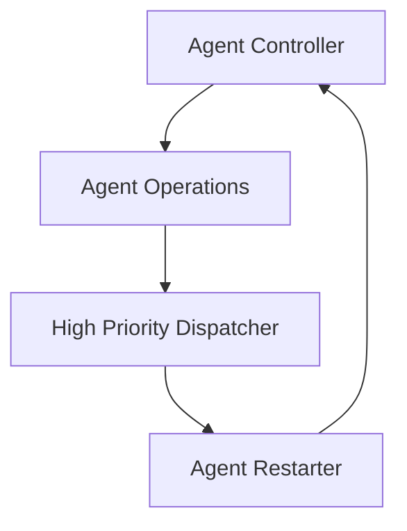
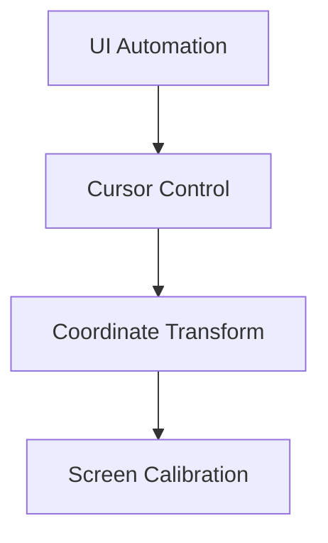
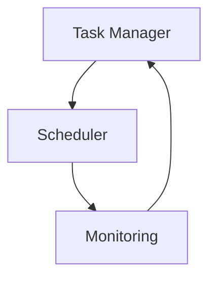

# Dream.OS Module Documentation

## Directory Structure

### Core Components
- `dreamos/` - Core system implementation including orchestrator, messaging, agent management, and self-discovery modules.
- `tools/` - Utility scripts, automation helpers, and other development tools.
- `agent_tools/` - Agent utilities including mailbox management and onboarding resources.
- `discord_bot/` - Discord integration including the bot and command handlers.
- `crime_report_generator/` - Stand‑alone module used for generating crime reports.

### Documentation and Examples
- `docs/` - Project documentation and guides.
- `docs/examples/` - Code samples and examples demonstrating library usage.
- `agent_tools/mailbox/onboarding/training/` - Comprehensive training materials and skill library.

### Configuration and Data
- `config/` - Configuration files, templates, and environment settings.
- `runtime/` - Temporary runtime files (queues, logs, etc.).
- `data/` - Data artifacts including dev logs.

### Testing
- `tests/` - Unit and integration tests.
- `requirements-test.txt` - Additional dependencies needed for testing.

### Miscellaneous
- `gui/` - Simple GUI components used by the project.
- `social/` - Social media automation code.
- `prompts/` - Prompt templates and examples.

## Core Architecture

### 1. Agent Control System
```
dreamos/core/agent_control/
├── controllers/           # (To be created)
│   ├── base_controller.py
│   ├── agent_controller.py
│   └── system_controller.py
├── agent_operations.py    # Core agent operations
├── agent_restarter.py     # Agent recovery
├── agent_onboarder.py     # Agent initialization
└── high_priority_dispatcher.py  # Task routing
```

#### Current Responsibilities:
- `agent_controller.py`: Direct agent control
- `agent_control.py`: System-level control
- `controller.py`: Mixed system/agent control

#### Dependencies:
- `agent_operations.py` → Used by all controllers
- `agent_restarter.py` → Depends on controller state
- `agent_onboarder.py` → Uses controller for setup

### 2. Cursor Management
```
dreamos/core/cursor/
├── controller.py         # Main cursor control
├── calibration.py       # Screen calibration
└── transformation.py    # Coordinate transforms
```

#### Current Responsibilities:
- `cursor_controller.py` (core): Basic cursor operations
- `cursor_controller.py` (agent_control): Agent-specific cursor control
- `coordinate_transformer.py`: Screen coordinate mapping
- `coordinate_calibrator.py`: Screen calibration

#### Dependencies:
- All cursor modules → `pyautogui`
- Calibration → Transformation
- Agent control → Cursor control

### 3. UI Automation
```
dreamos/core/ui/
├── automation/
│   ├── base.py          # Core automation
│   └── menu.py          # Menu handling
├── dialogs/
│   └── agent_selection.py
└── dashboard/           # GUI components
```

#### Current Responsibilities:
- `ui_automation.py`: All UI interaction
- `menu_builder.py`: Menu construction
- `agent_selection_dialog.py`: Agent selection UI

#### Dependencies:
- All UI modules → `PyQt5`
- Automation → Cursor control
- Dialogs → Menu system

### 4. Task Management
```
dreamos/core/tasks/
├── manager.py           # Task orchestration
├── scheduler.py         # Task scheduling
└── monitoring.py        # Task monitoring
```

#### Current Responsibilities:
- `task_manager.py`: Task lifecycle
- `system_orchestrator.py`: System-wide orchestration
- `periodic_restart.py`: Scheduled restarts

#### Dependencies:
- All task modules → Agent control
- Scheduler → Monitoring
- Manager → Scheduler

## Component Interactions

### 1. Agent Control Flow


### 2. UI Control Flow


### 3. Task Flow


## Current Issues

### 1. Controller Duplication
- Multiple controller implementations
- Unclear responsibility boundaries
- Duplicate state management

### 2. Cursor Management
- Scattered cursor logic
- Inconsistent coordinate handling
- Duplicate calibration code

### 3. UI Automation
- Monolithic automation file
- Mixed concerns
- Hard to test

### 4. Task Management
- Scattered task logic
- Unclear orchestration
- Duplicate scheduling

## Refactor Dependencies

### Phase 1: Controllers
1. Create base controller
2. Migrate agent controller
3. Update system controller
4. Remove old controllers

### Phase 2: Cursor
1. Unify cursor control
2. Implement calibration
3. Add transforms
4. Update callers

### Phase 3: UI
1. Break down automation
2. Create menu system
3. Implement dialogs
4. Update references

### Phase 4: Tasks
1. Create task manager
2. Implement scheduler
3. Add monitoring
4. Migrate tasks

## Testing Requirements

### 1. Controller Tests
- Interface contracts
- State management
- Error handling

### 2. Cursor Tests
- Coordinate transforms
- Calibration accuracy
- Edge cases

### 3. UI Tests
- Automation flows
- Menu interactions
- Dialog handling

### 4. Task Tests
- Scheduling logic
- Monitoring accuracy
- Error recovery

## Documentation Needs

### 1. Code Documentation
- Interface contracts
- State management
- Error handling

### 2. Architecture Documentation
- Component interactions
- Data flow
- Error recovery

### 3. User Documentation
- Configuration
- Troubleshooting
- Best practices

## Quick Reference

For a quick visual overview of the directory structure, run:

```bash
tree -L 2
``` 